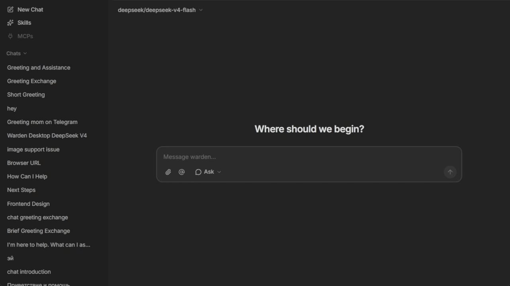

<p align="center">
  
</p>

<br />

<pre align="center">
██╗    ██╗ █████╗ ██████╗ ██████╗ ███████╗███╗   ██╗
██║    ██║██╔══██╗██╔══██╗██╔══██╗██╔════╝████╗  ██║
██║ █╗ ██║███████║██████╔╝██║  ██║█████╗  ██╔██╗ ██║
██║███╗██║██╔══██║██╔══██╗██║  ██║██╔══╝  ██║╚██╗██║
╚███╔███╔╝██║  ██║██║  ██║██████╔╝███████╗██║ ╚████║
 ╚══╝╚══╝ ╚═╝  ╚═╝╚═╝  ╚═╝╚═════╝ ╚══════╝╚═╝  ╚═══╝
</pre>

<p align="center">
  <strong>AI agent desktop shell with full computer control</strong> <em>(Windows only)</em>
</p>

<p align="center">
  <a href="https://github.com/elev1e1nSure/warden-desktop/releases/latest"></a>
  <a href="LICENSE"></a>
  <a href="https://tauri.app"></a>
  <a href="https://python.org"></a>
</p>

<p align="center">
  <a href="https://github.com/elev1e1nSure/warden-desktop/releases/latest"><strong>Download</strong></a>
  ·
  <a href="docs/README.md"><strong>Docs</strong></a>
  ·
  <a href="https://github.com/elev1e1nSure/warden-desktop/issues"><strong>Report bug</strong></a>
</p>

---

## What it does

Warden gives an AI agent hands. It reads and writes files, runs shell commands, takes screenshots, automates a headless browser, clicks the mouse, and manages windows — all through a chat interface.

Works with [OpenRouter](https://openrouter.ai) — bring any model: GPT, Claude, DeepSeek.

---

## Capabilities

```
Files       read · write · search · archives · patches
Shell       PowerShell · Bash · risk-based security
Browser     URLs · screenshots · clicks · forms
Screen      OCR · image search · mouse · keyboard
System      processes · windows · notifications · clipboard
Memory      long-term · retrieval · aggregation
Network     HTTP · web scraping
Code        LSP · session todo-list
```

### Modes

| Mode | Behavior |
|------|----------|
| **Ask** | Agent asks for confirmation before every action |
| **Auto** | Executes without confirmation; dangerous operations show a modal |
| **Custom** | Uses your permission settings; executes without confirmation for allowed tools |

---

## Quick Start

### Download installer

Go to [Releases](https://github.com/elev1e1nSure/warden-desktop/releases/latest) and download the latest NSIS installer (`*-setup.exe`).

### Build from source

Using `just` (recommended):

```powershell
# Install all dependencies (frontend and backend)
just install

# Run the complete development environment (frontend, backend, Tauri)
just dev

# Build the desktop application
just build-app
```

Or manually:

```powershell
# Install frontend dependencies
pnpm install

# Install backend dependencies (in backend/)
cd backend
uv sync --extra tools
cd ..

# Run the development environment
pnpm dev:all

# Build the application
pnpm build:app
```

Requires: Windows 10+, Node.js 22+, pnpm, Python 3.11+, uv, Rust toolchain, [playwright](https://playwright.dev), and optionally [just](https://github.com/casey/just).

All available commands:

```
install      Install all dependencies (frontend + backend + browser)
dev          Run full dev environment (frontend, backend, Tauri)
dev-frontend Run Vite frontend dev server
dev-backend  Run Python backend dev server
lint         Lint both frontend (Biome) and backend (Ruff)
format       Auto-format both frontend and backend
check        Typecheck + lint
test         Run all tests (frontend and backend)
build-app    Build desktop installer
build-backend Build backend executable (PyInstaller)
clean        Remove build artifacts and cached files
```

---

## Project structure

```
warden-desktop/
├── backend/       Python agent runtime, tools, memory, skills
├── src/           React UI
├── src-tauri/     Tauri shell, desktop packaging
├── scripts/       build & dev helpers
├── public/        static assets
└── docs/          documentation & architecture
```

Architecture, data flow, and source map → see [docs/README.md](docs/README.md).

---

## Stack

| Layer | Technologies |
|-------|-------------|
| Frontend | React 19 · TypeScript · Vite · Tailwind CSS · Framer Motion |
| Desktop | Tauri 2 (Rust) |
| Backend | Python · aiohttp |
| LLM | OpenRouter (OpenAI-compatible API) |
| Build | pnpm · PyInstaller · NSIS |

---

<p align="center">
  Built solo · open source · <a href="LICENSE">MIT License</a>
</p>
