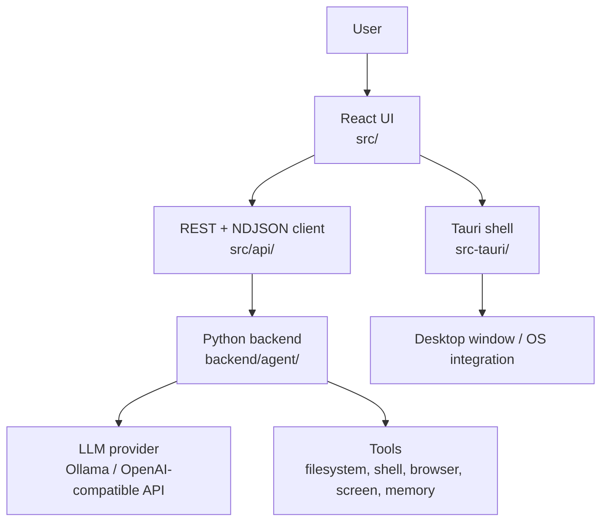

# Архитектура

Проект устроен как desktop shell вокруг существующего Warden backend.



## Слои

### React UI

Код находится в `src/`.

Главный файл — `src/App.tsx`. Он держит состояние UI: текущий чат, список чатов, выбранную модель, streaming state, confirmations, questions и переключение между chat view и skills view.

Важные папки:

- `src/components/` — визуальные компоненты: sidebar, timeline, input, modals, status bar.
- `src/api/` — клиент к backend.
- `src/types.ts` — UI-типы сообщений и блоков.
- `src/index.css`, `src/App.css` — стили приложения.

### API client

Код находится в `src/api/`.

- `client.ts` — REST-запросы к backend.
- `stream.ts` — streaming chat через `POST /chat` и NDJSON.
- `session.ts` — локальное хранение данных подключения.
- `types.ts` — типы backend events и responses.

Frontend ожидает backend на:

```text
http://localhost:8765
```

### Tauri shell

Код находится в `src-tauri/`.

Tauri отвечает за desktop-окно, настройки приложения и packaging. Основная конфигурация:

- `src-tauri/tauri.conf.json` — dev/build настройки, окно, app metadata.
- `src-tauri/tauri.bundle.conf.json` — дополнительные resources для bundled build.
- `src-tauri/src/` — Rust entrypoint приложения.
- `src-tauri/icons/` — app icons.

Окно приложения называется `warden`, стартовый размер — `1100x720`, минимальный — `720x480`.

### Python backend

Код находится в `backend/agent/`.

Backend предоставляет HTTP API для desktop UI и выполняет основную работу агента:

- chat session;
- streaming events;
- LLM client;
- tool execution;
- confirmations;
- memory;
- skills;
- safety policies.

Desktop UI не вызывает tools напрямую. Он отправляет сообщения backend и показывает события, которые backend стримит обратно.

## Поток сообщения


## Где искать правду

- UI behavior — `src/App.tsx` и `src/components/`.
- Backend endpoints — `backend/agent/server.py`.
- Streaming protocol — `src/api/stream.ts` и backend chat routes.
- Build scripts — `package.json`, `scripts/`, `src-tauri/`.
- Agent internals — `backend/agent/`.
