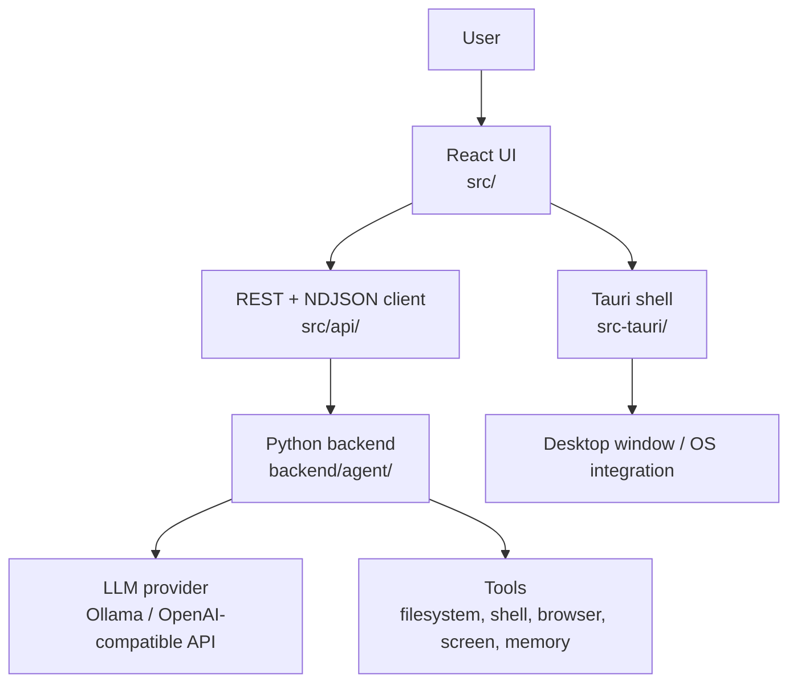
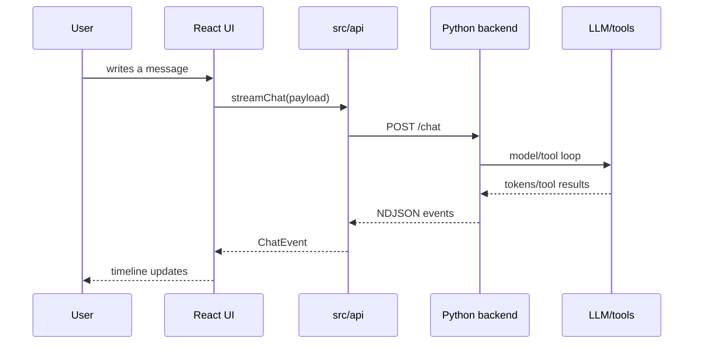

# Architecture

The project is structured as a desktop shell around the existing Warden backend.



## Layers

### React UI

The UI code is located in `src/`.

The main entry point is `src/App.tsx`. It manages the global UI state: active chat, chat list, selected LLM model, streaming state, confirmations, questions, and view switching between chat view and skills view.

Important directories:

- `src/components/` — UI components: sidebar, timeline, input, modals, status bar.
- `src/api/` — API client to communicate with the backend.
- `src/types.ts` — UI message and block type definitions.
- `src/index.css`, `src/App.css` — application styles.

### API Client

The client code is located in `src/api/`.

- `client.ts` — REST requests to the backend.
- `stream.ts` — streaming chat via `POST /chat` using NDJSON.
- `session.ts` — local storage helper for connection details.
- `types.ts` — backend event and response type mappings.

The frontend expects the backend server to be listening at:

```text
http://localhost:8765
```

### Tauri Shell

The Tauri wrapper is located in `src-tauri/`.

Tauri is responsible for the desktop window wrapper, window configuration, system integration, and packaging. Key configurations:

- `src-tauri/tauri.conf.json` — dev/build settings, window size, permissions, and app metadata.
- `src-tauri/tauri.bundle.conf.json` — additional resources for bundled build.
- `src-tauri/src/` — Rust entry point of the desktop application.
- `src-tauri/icons/` — application icons.

The application window is named `warden`. Its default window size is `1100x720` with a minimum size of `720x480`.

### Python Backend

The backend code is located in `backend/agent/`.

The backend exposes an HTTP API for the desktop UI and drives the agent runtime execution:

- chat session lifecycle;
- streaming events;
- LLM client interactions;
- tool execution;
- confirmation prompts;
- long-term memory;
- skills execution;
- safety policies.

The desktop UI does not run tools directly. It sends messages to the backend and renders the stream of events sent back by the agent.

## Message Flow



## Source Map

- UI behavior — `src/App.tsx` and `src/components/`.
- Backend endpoints — `backend/agent/server.py`.
- Streaming protocol — `src/api/stream.ts` and backend chat routes.
- Build scripts — `package.json`, `scripts/`, `src-tauri/`.
- Agent internals — `backend/agent/`.
