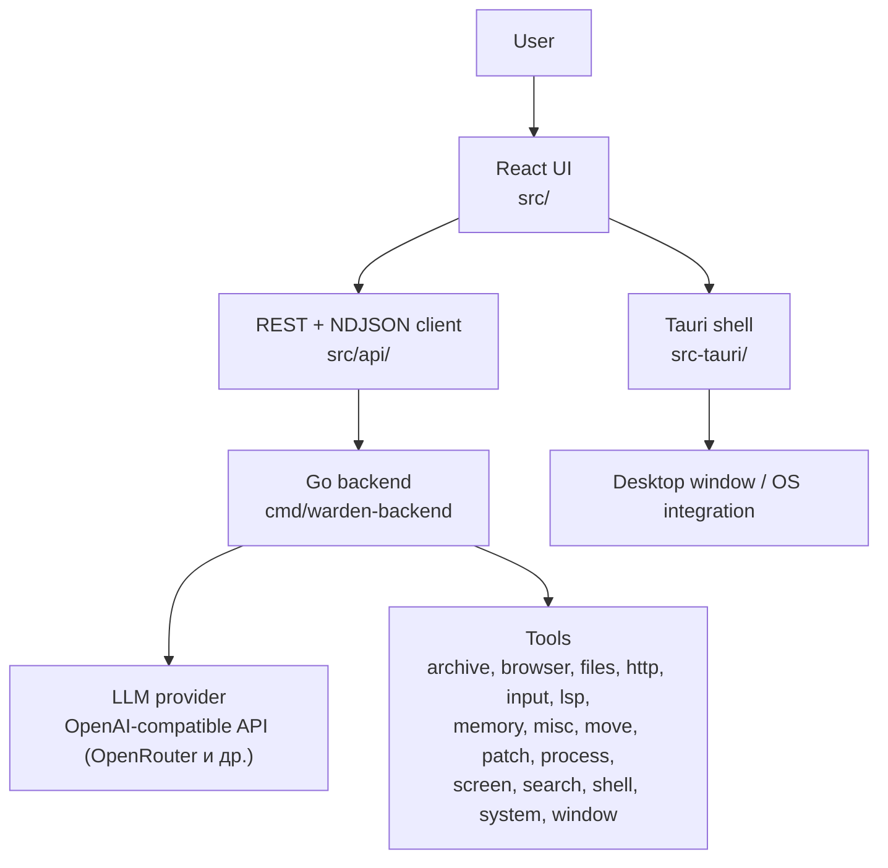
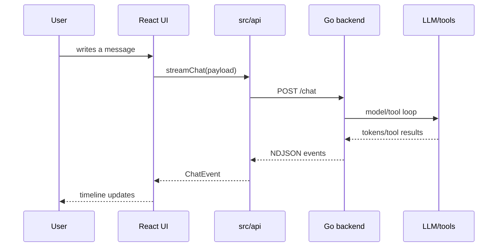

# Architecture

The project is structured as a desktop shell around the existing Warden backend.



## Layers

### React UI

The UI code is located in `src/`.

The main entry point is `src/App.tsx`. It manages the global UI state: active chat, chat list, selected LLM model, streaming state, confirmations, questions, and view switching between chat view and skills view.

Important directories:

- `src/components/` — UI components: sidebar, timeline, input, modals.
- `src/api/` — API client to communicate with the backend.
- `src/hooks/` — React hooks: streaming session, app initialization, updater, etc.
- `src/lib/` — Utilities and helpers.
- `src/types.ts` — UI message and block type definitions.
- `src/index.css`, `src/App.css` — application styles.

### API Client

The client code is located in `src/api/`.

- `client.ts` — REST requests to the backend.
- `stream.ts` — streaming chat via `POST /chat` using NDJSON.
- `session.ts` — local storage helper for connection details.
- `types.ts` — backend event and response type mappings.

The frontend expects the backend server to be listening at:

```text
http://localhost:8765
```

### Tauri Shell

The Tauri wrapper is located in `src-tauri/`.

Tauri is responsible for the desktop window wrapper, window configuration, system integration, and packaging. Key configurations:

- `src-tauri/tauri.conf.json` — dev/build settings, window size, permissions, and app metadata.
- `src-tauri/tauri.bundle.conf.json` — additional resources for bundled build.
- `src-tauri/src/` — Rust entry point of the desktop application. Rust spawns the Go backend and reads the backend token via `get_backend_token` command.
- `src-tauri/icons/` — application icons.

The application window is named `Warden`. Its default window size is `1100x720` with a minimum size of `720x480`.

### Authentication

The backend uses a shared secret token (`X-Warden-Token`) for API authentication:

- Token is generated on backend start and written to `~/.local/share/warden/.token`.
- Tauri shell reads it via `get_backend_token` command and includes in all API requests.
- CORS is enforced: only allowlisted origins can access the API (`tauri://localhost`, `http://localhost:1420`, `http://127.0.0.1:1420`).
- Dev mode (`WARDEN_DEV=1`) bypasses token requirement for local development.

### Go Backend

The backend code is located in `cmd/warden-backend/` (entry point) and `agent/` (runtime).

The backend exposes an HTTP API for the desktop UI and drives the agent runtime execution:

- chat session lifecycle;
- streaming events;
- LLM client interactions;
- tool execution;
- confirmation prompts;
- long-term memory;
- skills execution;
- safety policies.

The desktop UI does not run tools directly. It sends messages to the backend and renders the stream of events sent back by the agent.

## API Endpoints

| Method | Path | Description |
|--------|------|-------------|
| GET | `/health` | Health check (no auth) |
| POST | `/chat` | Streaming chat (NDJSON) |
| POST | `/reset` | Reset chat session |
| POST | `/upload` | File upload |
| POST | `/confirm` | Confirm dangerous action |
| POST | `/question` | Answer question prompt |
| POST | `/compact` | Compact chat context |
| GET | `/status` | Backend status (model, mode, tokens) |
| POST | `/connect` | Connect LLM provider |
| GET | `/models` | List available models |
| POST | `/model/set` | Set active model |
| POST | `/mode` | Set mode (ask/auto/custom) |
| GET | `/settings` | App settings |
| POST | `/settings` | Update settings |
| GET | `/permissions` | Permission levels |
| POST | `/permissions` | Update permission |
| GET | `/chats` | List chats |
| GET | `/chats/{id}` | Get chat with blocks |
| POST | `/chats/new` | Create new chat |
| POST | `/chats/select` | Switch active chat |
| POST | `/chats/rename` | Rename chat |
| POST | `/chats/delete` | Delete chat |
| POST | `/chats/blocks` | Save chat blocks |
| GET | `/skills` | List skills |
| GET | `/skill/{name}` | Get skill content |
| POST | `/skills/create` | Create skill |
| POST | `/skills/update` | Update skill |
| POST | `/skills/delete` | Delete skill |
| GET | `/tools` | List available tools |
| GET | `/memory/state` | Memory enabled status |
| POST | `/memory/state` | Enable/disable memory |
| POST | `/memory/clear` | Clear memory |
| GET | `/memory/snapshot` | Get memory snapshot |
| POST | `/shutdown` | Graceful shutdown |

Backend modules:

- `cmd/warden-backend/main.go` — HTTP server, CORS, auth middleware, route registration, handler setup.
- `agent/runner.go` — Chat session orchestration, streaming, tool loop.
- `agent/llm_client.go` — OpenAI-compatible LLM client (handles OpenRouter, reasoning, tool calls).
- `agent/session.go` — Chat session state management.
- `agent/confirm.go` — Confirmation and question prompt handling.
- `agent/tools/` — Individual tool implementations.
- `agent/safety/` — Safety policies: filesystem (path restrictions), policy (capability gates), PowerShell (constraints).
- `agent/memory/` — Long-term memory: aggregator, extractor, store.
- `agent/prompt.go` — System prompt construction.
- `internal/client/` — Shared client DTOs and stream types.
- `internal/security/` — Encryption helpers (token management).

## Message Flow



## Source Map

- UI behavior — `src/App.tsx`, `src/main.tsx`, `src/components/`, `src/hooks/`.
- Backend entry point — `cmd/warden-backend/main.go`.
- Backend agent runtime — `agent/` (runner, session, LLM client, tools, memory, safety).
- Streaming protocol — `src/api/stream.ts` and `agent/runner.go`.
- Auth & middleware — `cmd/warden-backend/main.go`.
- Build scripts — `package.json`, `scripts/`, `src-tauri/`, `justfile`.
- Agent internals — `agent/`.